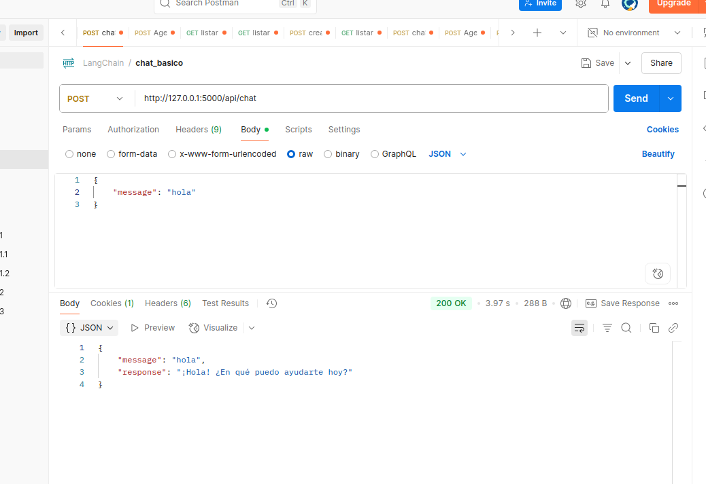
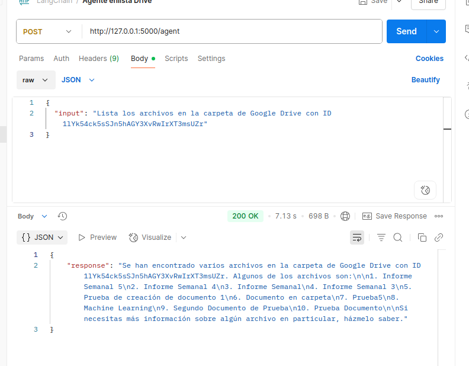
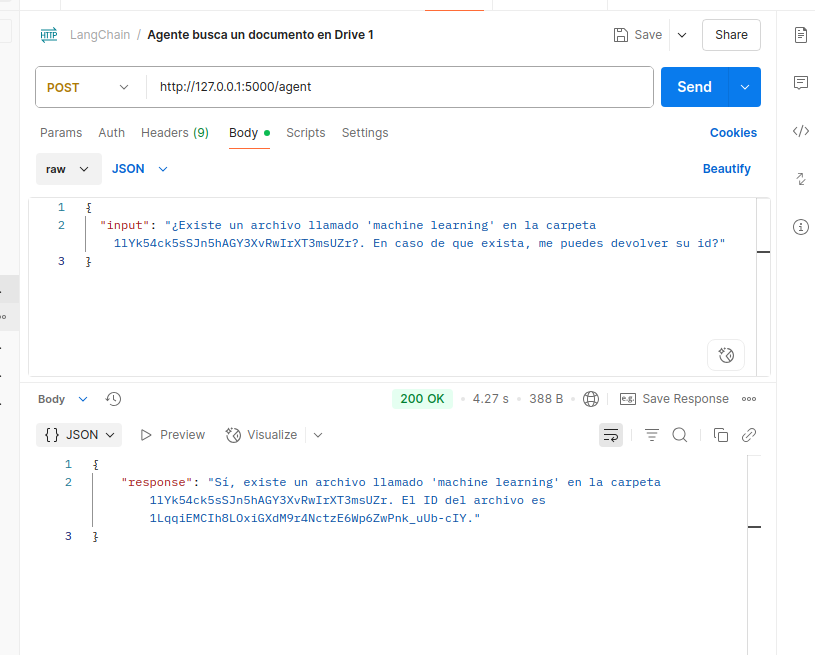
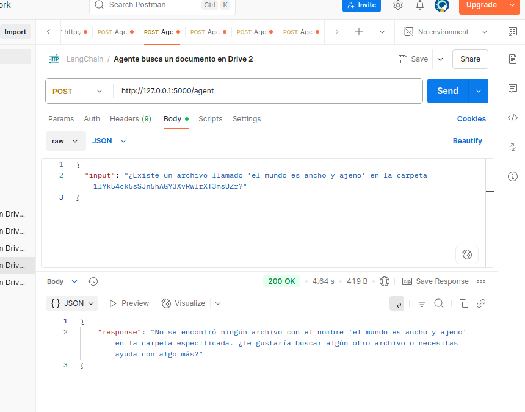

## 📦 Instalación

```bash
git clone https://github.com/tu_usuario/mi_api.git
cd mi_api

python3 -m venv venv
source venv/bin/activate

pip install -r requirements.txt
```

---

## 🔐 Variables de entorno

Crea un archivo `.env` en la raíz con:

```
OPENAI_API_KEY=sk-xxx
TAVILY_API_KEY=tvly-xxx
MODEL_NAME=gpt-3.5-turbo-0125
```

---
## 📁 Configuración de credenciales de Google Drive

Para que la API funcione correctamente con Google Drive, es necesario configurar las credenciales de servicio.

### 🔸 Paso 1: Crear carpeta de credenciales

Crea una carpeta llamada `creds/` en la raíz del proyecto y coloca dentro tu archivo de credenciales en formato JSON:

```bash
mkdir creds
mv tu_archivo_de_credenciales.json creds/driver_service.json
```

> 📌 El archivo debe llamarse exactamente `driver_service.json`, ya que el código lo carga desde esa ruta:

```python
SERVICE_ACCOUNT_PATH = "creds/driver_service.json"
```

### 🔸 Paso 2: Obtener credenciales desde Google Cloud

1. Ve a [Google Cloud Console](https://console.cloud.google.com/).
2. Crea un proyecto (si no tienes uno).
3. Habilita la API de Google Drive.
4. Ve a **IAM y administración > Cuentas de servicio**.
5. Crea una cuenta de servicio y genera una **clave en formato JSON**.
6. Descarga ese archivo JSON y colócalo como `creds/driver_service.json`.

---

## 🛡️ Recomendación de seguridad

Asegúrate de **no subir el archivo de credenciales al repositorio**. Para ello, incluye `creds/` en tu archivo `.gitignore`:

```bash
# .gitignore
creds/
```


## 🚀 Ejecutar el servidor

```bash
python app.py
```

Esto iniciará la API en: `http://localhost:5000`

---

## 🔍 Endpoints disponibles

### 1. `POST /api/chat`

Devuelve una respuesta simple desde el modelo OpenAI con un prompt personalizado.

#### 🔸 JSON de entrada

```json
{
  "message": "¿Qué es la inteligencia artificial?"
}
```


### 2. `POST /agent`

Ejecuta un agente LangChain con herramientas (Wikipedia, Tavily) y un modelo OpenAI.

#### 🔸 JSON de entrada

```json
{
  "input": "¿Quién fue Alan Turing?"
}
```
### 🧪 Pruebas con Postman

#### 📤 Chat API (`/api/chat`)


#### 🤖 Enlistar


#### 📂 Buscar y devolver id


#### 🔍 Buscar documento no existe

